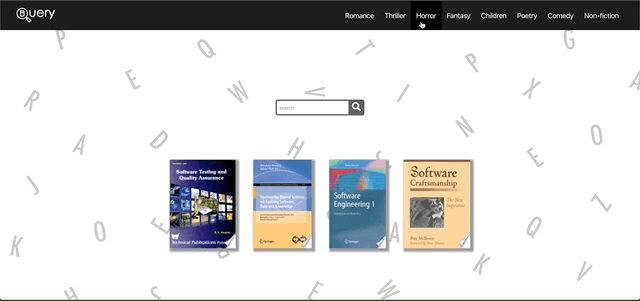
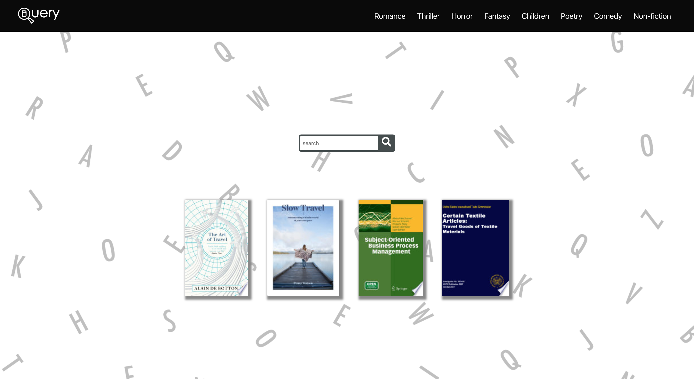

# 

<h1>General Assembly Project Two: Query</h1>

<h2>Goal: Within a team of two, build a React application that consumes a public API</h2>

| Contents                      |                |
| ------------------------------|----------------|
|1. [Overview](#overview)       |6. [Future content](#future)
|2. [Brief](#brief)             |7. [Wins](#wins)
|3. [Technologies used](#tech)  |8. [Blockers](#blockers)
|4. [App](#app)                 |9. [Bugs](#bugs)
|5. [Approach](#approach)       |10. [Future learnings](#learn)

<h2 name='overview'>Overview</h2>

<h3>Introduction</h3>

Query is an app that allows the user to search for any book in googles archive. The books will appear in pages allowing the user to click on them for further information. The user may also search for a book by its genre.

<h3>Deployment</h3>

The app is deployed on Heroku and can be found here: https://books-ga.herokuapp.com <br>

<h3>Team</h3>

• <a href='https://www.linkedin.com/in/clare-robertson-ab1ba0142/'>Clare Robertson</a> <br>

<h3>My contributions</h3>

• Pagination<br>
• Search bar<br>
• Books on home page<br>
• Background image and logo<br>

<h3>Timeframe</h3>

2 days

<h2 name='brief'>Brief</h2>

* **Consume a public API** – this could be anything but it must make sense for your project.
* **Have several components** - At least one classical and one functional.
* **The app should include a router** - with several "pages".
* **Include wireframes** - that you designed before building the app.
* **Have semantically clean HTML**
* **Be deployed online**

<h2 name='tech'>Technologies used</h2>
<p>1. HTML5 <br>
2. SCSS & Bulma <br>
3. JavaScript (ES6) <br>
4. JSON <br>
5. React.js <br>
6. Node.js <br>
7. Express.js <br>
8. Axios <br>
9. Insomnia <br>
10. Dotenv <br>
11. Google Books API <br>
12. Mapbox <br>
13. Z shell <br>
14. GitHub <br></p>

<h2 name='app'>App</h2>

The user can start by typing in the search bar the name or author of the book, and the most relevant results will appear. Once the user finds their book they can click on its card to take them to its info page.<br>
<br>
<br>

<br>
<br>
<br>
Another way to search would be by genre and we have given a few of the most common in the Navbar<br>
<br>
<br>

<br>
<br>
<br>
Finally a selection of 5 random books are loaded into the home page that the use can click to view.<br>
<br>
<br>

<br>
<br>
<br>
<h2 name='future'>Future content</h2>
<h3>Take a look</h3>
The Google Books API allows for selected books to be partly or fully read. I would like to incorporate this via a button on the books info page.
<br>
<br>
<br>
<h2 name='wins'>Wins</h2>
<h3>Pagination</h3>
Solving the pagination issue was really satisfying as the Google documentation does not specifically state how to use it, it just states:
You can paginate the volumes list by specifying two values in the parameters for the request:

startIndex - The position in the collection at which to start. The index of the first item is 0.
maxResults - The maximum number of results to return. The default is 10, and the maximum allowable value is 40.

So I decided to increase or decrease the index by 40 everytime the user clicked next or back, meaning the next 40 books would be loaded.


```javascript
  state = {
    data: [],
    search: '',
    index: 0
  }

  componentDidMount() {
    this.findBooks()
  }

  findBooks = async () => {
    const search = this.props.match.params.search
    const index = this.state.index
    try {
      const res = await axios.get(`https://www.googleapis.com/books/v1/volumes?q=${search}&maxResults=40&startIndex=${index}`)
      this.setState({ data: res.data.items })
      this.setState({ search }) 
    } catch (err) {
      console.log(err)
    }
  }

  next = () => {
    let newIndex = this.state.index
    const next = newIndex += 40
    this.setState({ index: next })
    this.findBooks()
  }

  back = () => {
    let index = this.state.index
    const back = index -= 40
    this.setState({ index: back })
    this.findBooks()
  }
```
<br>
<br>
<br>
<h3>Homepage books</h3>
This part was really fun for me as I grasped the concept of concatenation and mapping the results of an api request. Meaning I could display five books from 6 categories that link to their info pages and have them change randomly.

```javascript
  state = {
    volumeInfo: '',
    homeCategory: '',
    id: []
  }

  randomCats = [
    'novels',
    'non-fiction',
    'software',
    'history',
    'young-fiction',
    'travel'
  ]
  
  async componentDidMount() {
    try {
      const i = Math.floor(Math.random() * this.randomCats.length)
      const res = await axios.get(`https://www.googleapis.com/books/v1/volumes?q=asubject:${this.randomCats[i]}&maxResults=4`)
      const info = res.data.items
      let usefulInfo = info.map(item => (
        item.volumeInfo.imageLinks
      ))
      usefulInfo = usefulInfo.filter(item => item)
      this.setState({ volumeInfo: usefulInfo, id: info })

    } catch (error) {
      console.log(error)
    }
  }


  render() {
    if (!this.state.volumeInfo) return null
    return (
      <section className='hero is-fullheight-with-navbar'>
        <div className='hero-body'>
          <div className='container'>
            <Searchbr history={this.props.history} />
            <div className='display'>
              {this.state.volumeInfo.map((image, i) => (
                <Link key={i} to={`/books/1/results/${this.state.id[i].id}`} >
                  
                </Link>
              )  
              )}
            </div>
          </div>
        </div>
      </section>

    )
  }
```
<br>
<br>
<br>
<h2 name='blockers'>Blockers</h2>
<h3>Search bar</h3>
The concept of sending the searched for term into the url and then separately loading the page and taking the url down to then be searched was a really unexpected way to work.
<br>
<br>
<h3>Props</h3>
Passing down the props was a tricky idea to get my head around. But realizing that you can add any props to the component and it would appear like your adding properties to an object helped me really grasp how React worked
<br>
<br>
<br>
<h2 name='bugs'>Bugs</h2>
<h3>Pagination</h3>
When trying to click the next button, the first time it is clicked the new books do not appear. The index changes but the pages do not re-render. This means the user must click it twice for the page to re-render.<br>
<br>
<br>

<br>
<br>
<h3>Navbar</h3>
The navbar does not work when used on the results page. The url is changed but the page does not reload. I think this is because the actual component is not changing and therefore the url is not searched.
<br>
<br>
<h3>Logo</h3>
The logos link will break after interacting with the sight for a while.
<br>
<br>
<h3>Info paragraph</h3>
When the books info page is loaded, often some inline html will be included with the paragraph.
<h2 name='learn'>Future learnings</h2>
• Learn how to work with a searchbar<br>
• Learn how to remove html from text<br>
